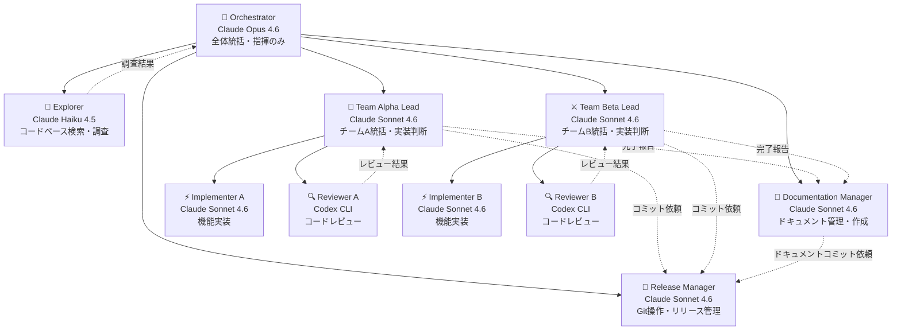

# Agent Teams 構成ガイド

本プロジェクト（幕末ファンタジーRPG）における AI Agent Teams の構成・運用指針。

## チーム構成図



## ロール定義

### Orchestrator（1名・Opus 4.6 専用）

| 項目 | 内容 |
|------|------|
| **エンジン** | Claude Opus 4.6（本プロジェクトで唯一の Opus） |
| **役割** | 全体統括、アーキテクチャ判断、タスク分割・割り振り |
| **責務** | 2チームへのタスク配分、チーム間の依存関係調整、品質最終判断 |
| **やらないこと** | コード実装、ドキュメント作成・編集、Git操作、レビュー等の実作業すべて |

### Documentation Manager（1名・Orchestrator 直轄）

| 項目 | 内容 |
|------|------|
| **エンジン** | Claude Sonnet 4.6 |
| **サブエージェント種別** | `general-purpose` |
| **役割** | プロジェクト全体のドキュメント管理・作成・更新 |
| **管轄ファイル** | `CLAUDE.md`、`docs/` 配下すべて（PLAN.md, REQUIREMENTS.md, AGENT_TEAMS.md, EFFORT_ESTIMATION_GUIDE.md, PHASE*_ACTUALS.md 等） |
| **入力** | Orchestrator からの指示、両チームの Team Lead からの完了報告 |
| **責務** | Phase完了サマリー作成、PLAN.md 更新、工数実績記録、CLAUDE.md 同期、書式・粒度の一貫性維持 |
| **利点** | チーム非依存で横断的に管理。両チームの成果を偏りなく記録できる |

### Release Manager（1名・Orchestrator 直轄）

| 項目 | 内容 |
|------|------|
| **エンジン** | Claude Sonnet 4.6 |
| **サブエージェント種別** | `general-purpose` |
| **役割** | Git操作の一元管理（commit / push / ブランチ管理） |
| **責務** | コミット作成（適切なメッセージ付与）、リモートへのプッシュ、ブランチ戦略管理 |
| **トリガー** | Orchestrator からの指示、または以下の自動トリガー |
| **自動コミットタイミング** | (1) 各タスク完了時 (2) Phase完了時 (3) ドキュメント更新完了時 |
| **コミットルール** | 変更内容を確認し適切な粒度でコミット。機密ファイル(.env等)の除外チェック |

### Explorer（1名・Orchestrator 直轄）

| 項目 | 内容 |
|------|------|
| **エンジン** | Claude Haiku 4.5 |
| **サブエージェント種別** | `Explore` |
| **役割** | 高速コードベース検索、影響範囲調査 |
| **制約** | 読み取り専用。コード変更不可 |

### Team Alpha / Team Beta（各チーム3名）

| # | ロール | エンジン | サブエージェント種別 | 担当領域 |
|---|--------|----------|---------------------|----------|
| 1 | **Team Lead** | Claude Sonnet 4.6 | `general-purpose` | チーム内タスク管理、実装判断、Implementer への指示 |
| 2 | **Implementer** | Claude Sonnet 4.6 | `general-purpose` | 機能実装、コード記述、バグ修正 |
| 3 | **Reviewer** | Codex CLI | `Bash` | コードレビュー、静的解析、品質チェック |

## モデル使用方針

| モデル | 使用箇所 | 理由 |
|--------|----------|------|
| **Opus 4.6** | Orchestrator のみ | 最高性能。全体統括・判断に専念させコスト効率化 |
| **Sonnet 4.6** | Doc Manager × 1、Release Manager × 1、Team Lead × 2、Implementer × 2 | 実装速度と品質のバランス。並列実行に最適 |
| **Haiku 4.5** | Explorer | 高速・低コスト。検索・調査タスクに十分 |
| **Codex CLI** | Reviewer × 2 | サンドボックス内静的解析。Phase 完了時レビュー |

## エージェント総数

| 区分 | 人数 | 内訳 |
|------|------|------|
| Orchestrator | 1 | Opus 4.6 |
| 直轄スタッフ | 3 | Documentation Manager (Sonnet)、Release Manager (Sonnet)、Explorer (Haiku) |
| Team Alpha | 3 | Lead + Implementer (Sonnet) + Reviewer (Codex) |
| Team Beta | 3 | Lead + Implementer (Sonnet) + Reviewer (Codex) |
| **合計** | **10** | |

## 2チーム並行運用のルール

### 1. タスク分割原則

Orchestrator がフェーズ開始時にタスクを**依存関係のない2グループ**に分割し、各チームに割り振る。

```
例: Phase 9 の場合
  Team Alpha: マップ系タスク（マップ作成、NPC配置、遷移設定）
  Team Beta:  データ系タスク（敵データ、アイテム、スキル追加）
  Doc Manager: 並行して PLAN.md 更新、Phase開始記録
  Release Manager: タスク完了ごとにコミット・プッシュ
```

### 2. 依存関係の管理

- **チーム間依存がある場合**: Orchestrator が順序を制御（Alpha 完了 → Beta 開始）
- **チーム内依存**: Team Lead が管理
- **共有リソース競合**: Orchestrator が調整（同一ファイルの同時編集を防ぐ）
- **ドキュメント更新**: Documentation Manager が一元管理（チームからの直接編集は禁止）
- **Git操作**: Release Manager が一元管理（他エージェントは直接 git コマンドを実行しない）

### 3. ファイル競合防止

2チームが同時に同じファイルを編集しないよう、Orchestrator がファイル所有権を割り当てる。

| パターン | 対応 |
|----------|------|
| 完全独立ファイル | 各チーム自由に編集 |
| 共有ファイル（追記のみ） | 編集順序を指定（Alpha 先 → Beta 後） |
| 共有ファイル（構造変更） | 片方のチームのみに割り当て |
| ドキュメントファイル | Documentation Manager 専任（チームは編集しない） |
| Git操作 | Release Manager 専任（他エージェントは git コマンド禁止） |

### 4. 進捗報告・同期

- Team Lead は各タスク完了時に Orchestrator へ報告
- Orchestrator は Documentation Manager にドキュメント更新を指示
- Orchestrator は Release Manager にコミット・プッシュを指示
- Orchestrator は必要に応じてチーム間の情報共有を実施
- Phase 完了時は両チームの成果を統合レビュー

## Phase 別の活用パターン

### 標準パターン（Phase 9 以降）

```
1. Orchestrator: タスク分析・分割（Explorer で調査）
2. Orchestrator → Team Alpha: タスクグループA 割り振り
   Orchestrator → Team Beta:  タスクグループB 割り振り（並行開始）
   Orchestrator → Doc Manager: Phase開始記録・PLAN.md 更新
3. Team Alpha: Lead → Implementer → Reviewer（チーム内サイクル）
   Team Beta:  Lead → Implementer → Reviewer（チーム内サイクル）
   Doc Manager: 完了報告を受けて随時ドキュメント更新
   Release Manager: タスク完了ごとにコミット・プッシュ
4. Orchestrator: 両チーム成果統合、最終確認
5. Orchestrator → Doc Manager: Phase完了サマリー作成、CLAUDE.md 更新
6. Orchestrator → Release Manager: Phase完了コミット・プッシュ
7. Orchestrator: Phase完了判定
```

### チーム内ワークフロー

```
1. Team Lead: タスク内容を理解、実装方針決定
2. Team Lead → Implementer: 実装指示
3. Implementer: コード実装
4. Team Lead → Reviewer: レビュー依頼
5. Reviewer: Codex CLI でレビュー実施
6. Team Lead: レビュー結果に基づき修正判断
7. Team Lead → Orchestrator: 完了報告
8. Orchestrator → Release Manager: コミット指示
```

### Documentation Manager ワークフロー

```
1. Orchestrator から指示を受信（「Phase X 開始を記録して」等）
2. 両チームの Team Lead から完了報告を受信
3. ドキュメント作成・更新（CLAUDE.md, PLAN.md, PHASE*_ACTUALS.md 等）
4. Orchestrator へ更新完了を報告
5. Orchestrator → Release Manager: ドキュメントコミット指示
```

### Release Manager ワークフロー

```
1. Orchestrator からコミット指示を受信
2. git status / git diff で変更内容を確認
3. 適切な粒度でファイルをステージング（機密ファイル除外チェック）
4. コミットメッセージ作成（変更内容を反映した簡潔なメッセージ）
5. コミット実行
6. リモートへプッシュ
7. Orchestrator へ完了報告（コミットハッシュ付き）
```

## 運用ルール

1. **Opus 4.6 は Orchestrator 専用**: コスト最適化のため、実作業には一切使用しない
2. **Orchestrator は指揮のみ**: コード実装、ドキュメント作成、Git操作、レビュー等の実作業は行わない
3. **ドキュメントは Doc Manager 専任**: CLAUDE.md・docs/ 配下の編集権限は Documentation Manager のみ
4. **Git操作は Release Manager 専任**: commit / push / branch 操作は Release Manager のみが実行
5. **Phase 完了時レビューは必須**: 各チームの Reviewer による Phase 完了時レビュー + Orchestrator の最終確認
6. **並列化の原則**: 依存関係のないタスクは2チームで並列実行
7. **Explorer は Orchestrator 直轄**: 両チームからの調査依頼は Orchestrator 経由で処理
8. **ファイル競合は事前防止**: Orchestrator がタスク割り振り時にファイル所有権を明示
9. **チーム間通信は Orchestrator 経由**: Team Alpha ↔ Team Beta の直接通信は行わない
10. **定義外エージェント禁止**: 本ドキュメントの「ロール定義」に記載されたロール以外のエージェントは起動しないこと。一時的なセットアップ用エージェント等も禁止。すべての作業は定義済みロール（Orchestrator, Documentation Manager, Release Manager, Explorer, Team Alpha Lead/Implementer/Reviewer, Team Beta Lead/Implementer/Reviewer）のいずれかに割り当てること
