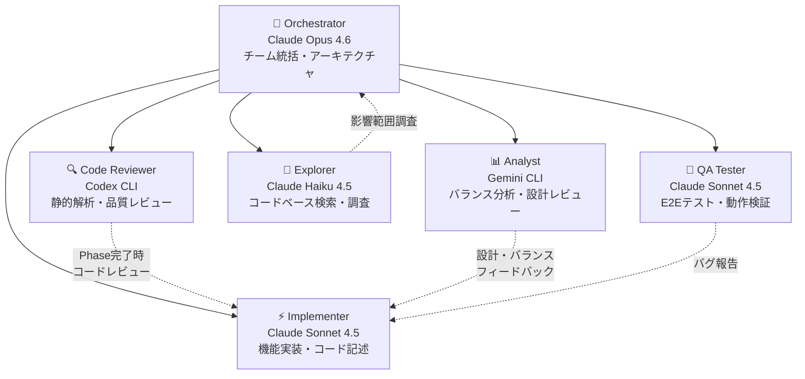

# Agent Teams 構成ガイド

本プロジェクト（幕末ファンタジーRPG）における AI Agent Teams の構成・運用指針。

## チーム構成図

## ロール定義

| # | ロール | エンジン | サブエージェント種別 | 担当領域 |
|---|--------|----------|---------------------|----------|
| 1 | **Orchestrator** (Team Lead) | Claude Opus 4.6 | - (メインエージェント) | チーム統括、アーキテクチャ判断、複雑な実装 |
| 2 | **Implementer** | Claude Sonnet 4.5 | `general-purpose` | 機能実装、コード記述、高速イテレーション |
| 3 | **Code Reviewer** | Codex CLI | `Bash` | 静的解析、コード品質レビュー、Phase完了時レビュー |
| 4 | **Analyst** | Gemini CLI | `Bash` | 別視点のコードレビュー、ゲームバランス分析、ドキュメントレビュー |
| 5 | **Explorer** | Claude Haiku 4.5 | `Explore` | 高速コードベース検索、調査、影響範囲分析 |
| 6 | **QA Tester** | Claude Sonnet 4.5 | `e2e-runner` / `general-purpose` | 通しプレイテスト、E2Eテスト、動作検証 |

## Codex / Gemini の使い分け

| 観点 | Codex CLI (Code Reviewer) | Gemini CLI (Analyst) |
|------|---------------------------|----------------------|
| **得意領域** | コード品質、バグ検出、リファクタ提案 | ゲームデザイン分析、ドキュメントレビュー、バランス提案 |
| **実行タイミング** | Phase完了時（必須） | 設計レビュー、バランス調整時（随時） |
| **コマンド形式** | `codex exec --full-auto --sandbox read-only --cd <dir> "<request>"` | `gemini -p "<request>"` |
| **ロール選定理由** | Codex はサンドボックス内でコードを実行・解析でき、静的解析やバグパターン検出に特化している。`--sandbox read-only` により安全にコードベース全体を走査でき、Phase完了時の品質ゲートとして最適。 | Gemini はマルチモーダル対応と大規模コンテキストウィンドウを持ち、ゲームバランスの数値分析やシナリオの整合性チェックなど、コード外の観点を含む横断的な分析に強みがある。実装詳細よりも設計・企画レベルのレビューに適している。 |

## Phase別の活用パターン

### Phase 7: デモ版マップ＆シナリオ統合（残タスク）

| タスク | 担当ロール | 備考 |
|--------|-----------|------|
| バランス調整 | Implementer + Analyst | Gemini でバランス分析→Implementer で数値反映 |
| 演出調整 | Implementer | フェード速度、BGM音量等 |
| 通しプレイテスト | QA Tester | プロローグ→Chapter 1-3→エピローグ |
| Phase完了レビュー | Code Reviewer + Analyst | Codex + Gemini の2重レビュー |

### Phase 8: ストーリー拡張

| タスク | 担当ロール | 備考 |
|--------|-----------|------|
| シナリオ設計 | Orchestrator + Analyst | 史実考証、ストーリー整合性 |
| マップ実装 | Implementer (A) | マップデータ作成 |
| イベント実装 | Implementer (B) | イベントスクリプト作成（並列実行） |
| 敵データ作成 | Implementer + Analyst | バランス検証込み |
| Phase完了レビュー | Code Reviewer + Analyst | 2重レビュー |

### Phase 9-12: システム拡張〜モバイル対応

| タスク | 担当ロール | 備考 |
|--------|-----------|------|
| 設計 | Orchestrator + Explorer | 既存コード影響調査 |
| 実装 | Implementer × 複数並列 | 独立タスクを並列化 |
| 品質保証 | QA + Code Reviewer + Analyst | 3重チェック体制 |

## 運用ルール

1. **Phase完了時レビューは必須**: Codex CLI によるコードレビューを全Phase完了時に実施（CLAUDE.md Principles に記載）
2. **並列化の原則**: 依存関係のないタスクは Implementer を複数並列で実行
3. **Explorer は軽量タスクに**: Haiku ベースのため高速だがコード変更不可。調査・検索に限定
4. **Analyst は設計段階で活用**: 実装後のレビューだけでなく、設計段階での分析・提案にも活用
5. **QA Tester はマイルストーンで**: 全タスク完了後ではなく、機能単位での検証を推奨
